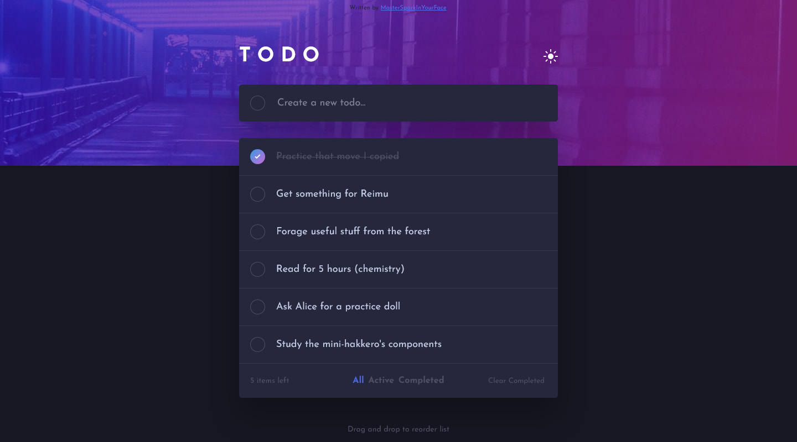
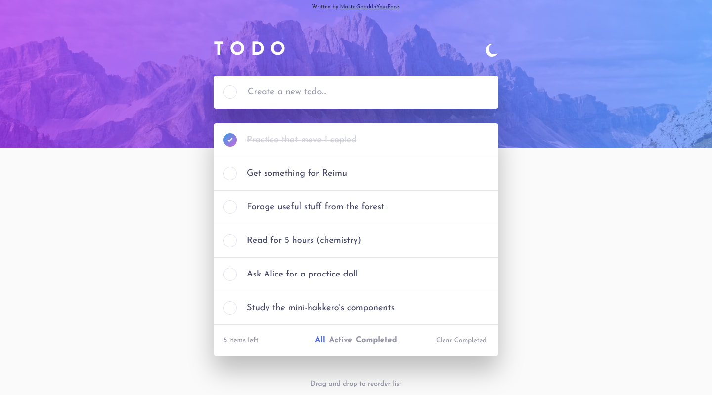
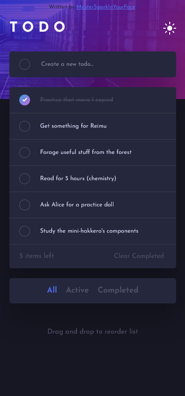
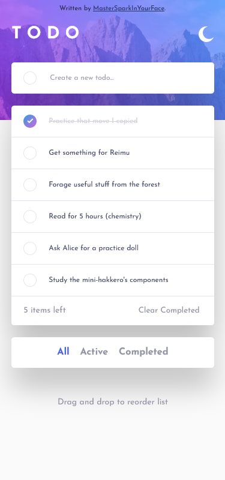

# Frontend Mentor - Todo app solution

This is a solution to the [Todo app challenge on Frontend Mentor](https://www.frontendmentor.io/challenges/todo-app-Su1_KokOW).

## Overview

### Screenshots

### Built with

- HTML5
- Sass
- JS

### What I learned

I actually learned some stuff this time. mostly about drag and drop stuff from MDN. 
oh yeah and I wrote a sort of rendering library for this. you can use it if you want,
but I'm putting GPL-3 on it. capitalists owned lol (we live in a society) 
I probably learn a lot during these projects but I don't really keep track of any of it
so let's just say I knew everything beforehand and I'm smart

### Useful resources

- [MDN](https://developer.mozilla.org): first reference for web things
- [StackOverflow](https://stackoverflow.com): obviously

## Acknowledgments

I borrowed a pattern from a project I helped someone with earlier, but privacy is a thing, so if you know, you know
